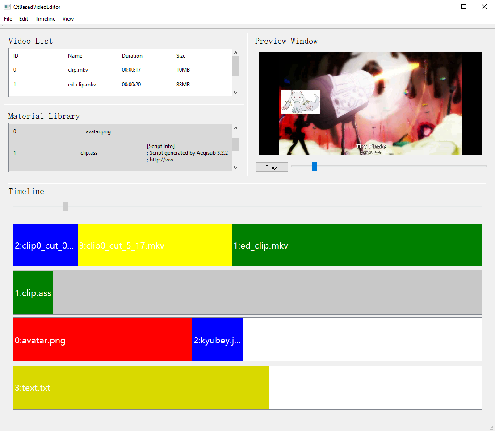

# Qt-based-video-editor
A Qt-based(Qt5) video editing software. Using FFmpeg as the backend.

## Features

### Overview

- [x] Import and export video
- [x] Cut video
- [x] Add material to video
- [x] Preview video
- [x] Manage videos and  materials
### Interface



You can read the detailed Chinese version of document [here](./doc/README_cn.md), for content like the design. If you want to know more about the project, don't hesitate to contact me.
## Build

Dependencies: Qt5, FFmpeg.

This project is built with CMake. You can build it in vscode by extension `CMake Tools`. Or you can build it in command line:

```bash
mkdir build
cd build
cmake ..
cmake --build . # default build type is Debug. You can use `cmake --build . --config Release` to build in Release mode
```

Because it depends on FFmpeg, you need to copy the FFmpeg files to directory of the executable file. It uses `ffmpeg` and `ffprobe`.
